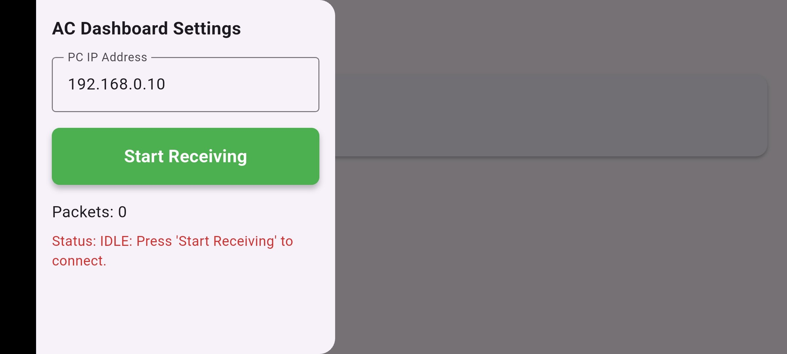
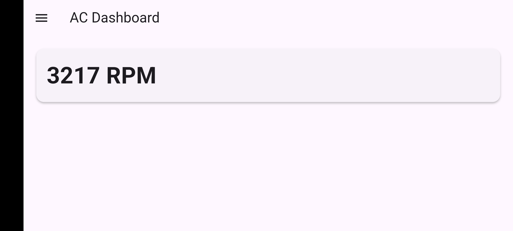

<<<<<<< HEAD
# Assetto Corsa Telemetry Dashboard
=======
# assettodash
>>>>>>> dafaad39901525dad6d7961c5a6174710a44e516

A cross-platform application built with Flutter that receives real-time telemetry data via UDP from **Assetto Corsa** running on a PC. Display live vehicle data such as engine RPM directly on your smartphone or tablet while racing.

  
  

---

## 🚀 Features

- **Cross-platform** — runs on Android, iOS, Windows, Linux, macOS, and Web
- **IP address configuration** — enter your PC's local IP address via the in-app drawer
- **Persistent settings** — last-used IP address is saved automatically
- **Connection control** — Start / Stop buttons with automatic retry every 2 seconds until Assetto Corsa responds
- **Real-time data display**
  - Engine RPM (live, updated at 5 Hz)
  - Packet receive counter
  - Connection status

---

## 🔧 Technical Stack

| Item | Detail |
|---|---|
| Framework | Flutter (Dart) |
| Communication | UDP port 9996 |
| Packet format | Little Endian binary |
| Supported platforms | Android / iOS / Windows / Linux / macOS / Web |

---

## 📐 Data Offsets Reference (RTCarInfo — 328 bytes)

| Field | Offset | Type | Description |
|---|---|---|---|
| `speed_Kmh` | 8 | float32 | Speed (km/h) |
| `speed_Mph` | 12 | float32 | Speed (mph) |
| `engineRPM` | 68 | float32 | Engine RPM |
| `steer` | 72 | float32 | Steering angle (−1 to 1) |
| `gear` | 76 | uint32 | Gear (0=R, 1=N, 2+=forward) |
| `gas` | 56 | float32 | Throttle (0–1) |
| `brake` | 60 | float32 | Brake (0–1) |
| `lapTime` | 40 | uint32 | Current lap time (ms) |
| `lastLap` | 44 | uint32 | Previous lap time (ms) |
| `bestLap` | 48 | uint32 | Best lap time (ms) |

Full packet specification: see [AC_Telemetry_Implementation_Guide_en.md](AC_Telemetry_Implementation_Guide_en.md)

---

## 📱 Setup

1. Run Assetto Corsa on your PC
2. Make sure your PC and smartphone are on the **same Wi-Fi network**
3. Find your PC's local IP address (`ipconfig` on Windows)
4. Launch this app, open the drawer (☰), enter the IP, and tap **Start Receiving**

> Port **9996** must not be blocked by your firewall.